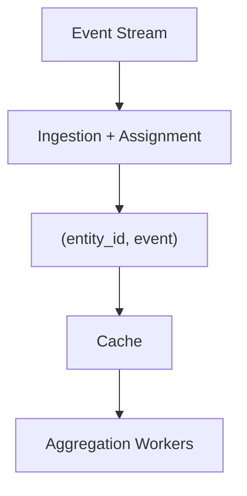
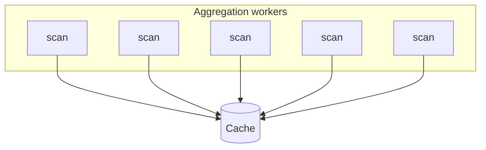
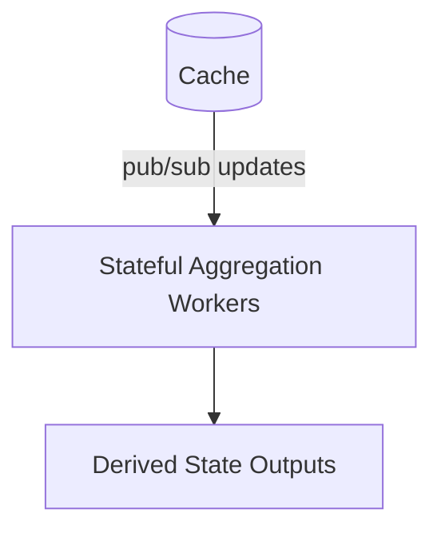
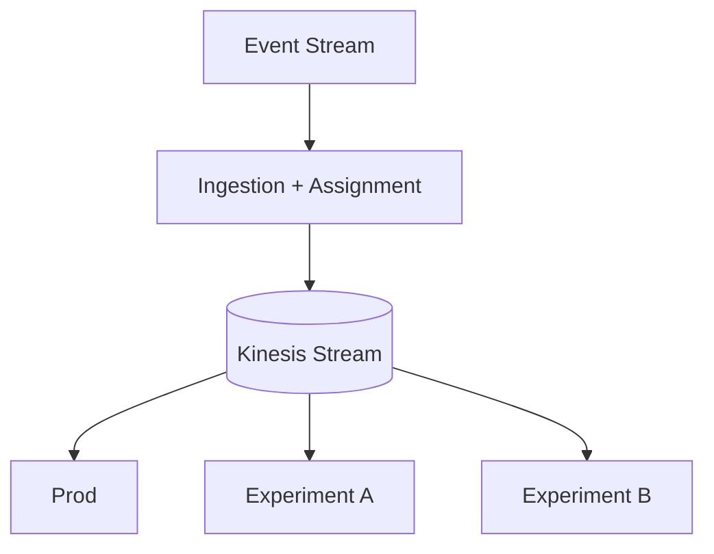

# Introduction

With many real-time systems, there’s a pretty standard shape:

- ingest from a high-volume event stream
- assign those events to some entity
- periodically recompute derived state from recent observations

At small to medium scale, a shared cache (Redis/Valkey) works great as the boundary between ingestion and aggregation. However, at a large enough scale, this same cache configuration can become this biggest bottleneck to both a performant data pipieline and developer velocity in terms of attaching to it or spinning up parallel pipelines.

This post walks through a tradeoff I ran into:
**using a distributed cache vs a streaming system (Kinesis)** as the interface between live data ingestion and downstream computation.

*Above: Last attempt at a Gemini AI-generated diagram for this just on a whim, attempting to show how Kinesis enables multi-tenant consumption of a high-read resource that, as a cache, would be overwhelmed or trigger excessive queuing, as represented by the well.*

## System Overview

Stripping away from my domain specifics (live probe data from real-world telemetry map matched onto a road network and then generating real-time speeds), the system looks like this:

- ~100M events per minute (~1.6M/sec)
- each event is assigned to one of hundreds of millions of possible entities
- at any moment, ~250–500M entities are “active”

There are two main stages:

### 1. Ingestion + Assignment

- clean raw events
- run compute-heavy assignment (classification / matching)
- emit output data with pairing metadata `(entity_id, event)`

### 2. Aggregation / Estimation

- group entities into partitions
- periodically recompute derived state using *all qualifying recent events*

## The Initial Design: Cache-Centric

After assignment, all events are written into a distributed cache (Redis/Valkey). Aggregation workers then:

- scan all relevant keys for a partition
- load everything into memory
- compute derived state
- repeat frequently (potentially sub-minutely - so high rate of revolution)

This had worked well enough for a while. But a problem in the design was present that kept rising up: **aggregation is stateless**. That means every run starts from scratch - reading all of the cache for its respective partition.

## The Problem: Read Amplification

At this scale, the system isn’t just write-heavy; it is also *extremely read-heavy*. So, in practice, the cache layer was handling:

- **~660K operations/sec (reads + writes)**
- **~510 MB/sec sustained network throughput**
- **~1.6 KB average payload size**
- across **24 shards**

Each aggregation cycle:

- re-reads large portions of recent data
- across many partitions
- often in parallel

The consquence of this was a few major issues:

### 1. Read amplification

The same data is read repeatedly, even when only a small fraction has changed.

### 2. Synchronized load spikes

Many workers scanning the same partitions at the same time:

### 3. Contention

- ingestion writes
- aggregation reads

…all competing for the same resource.

Interestingly, the system settled into roughly a **1:1 read-to-write ratio**—but that hides the real issue that the reads are large, repeated scans, not incremental updates.

## Naive Solution: Scale the Cache

The first fix is the obvious one which was taken first:

- add more nodes
- increase memory
- scale throughput

This works and bought us lots of time, but it’s expensive and doesn’t address the underlying inefficiency.

In our case:

- ~24 shards
- node type: `cache.r7g.4xlarge`
- **~$13,500/month**

And more importantly the system must be provisioned for peak load at all times. Furthermore, every time a developer wants to work with the same data, we can't just add a new consumer to the cache - that would cause the cache to fall over. So we need to create a new pipeline to feed a new cache. This is a lot of pipeline duplicate and very expensive. The developer time involved in doing this is often prohibitively high, not to mention the operational complexity of accomplishing it.

### A subtle scaling problem

Unlike compute systems (Lambda, ECS, etc.), cache scaling is not elastic:

- scaling out (adding shards) is manual and slow
- scaling in (removing shards) is risky and disruptive
- no true autoscaling based on load

The result, in reality, is that you provision for peak and pay for it even at trough. In a production system, where you want to buy a lot of headroom (literally), this can get pricey on serious workload caches very fast.

## Next solution: Make Consumers Stateful

One idea was to flip the model; so, instead of repeatedly scanning the cache:

- make aggregation workers stateful
- assign each worker a stable partition
- maintain local in-memory state
- update incrementally via pub/sub

Redis (and Valkey) support **keyspace notifications**, which can be used as a lightweight pub/sub mechanism.

The main advantages of this approach are that it avoids repeated full scans of the data and significantly reduces read pressure on the cache. However, this approach comes with its own set of tradeoffs:

- requires stable partition ownership
- introduces stateful workers
- harder failure recovery (e.g. handling cold starts)
- still tied to shared cache
- does *not* solve multi-consumer needs (lots of cold starts, deploys are all stampeding herd situations, can destabilize prod stack)

So, while this solution has merit and does incrememntally help, it doesn’t solve the bigger problem.

## The Bigger Problem: Coupling

The cache bottleneck exposes a deeper problem that the ingestion pipeline and aggregation logic are tightly coupled. If someone wants to try a new model or experiment they had to re-run ingestion and including the expensive assignment step; as noted prior. In practice this means:

- duplicate pipelines
- high compute cost
- backpressure on shared services
- slow iteration

At this scale, recomputing upstream work is often more expensive than storing and distributing it.

## The Constraint: Unsafe Multi-Tenancy

So, fundamentally, this architecture of a shared cache cannot safely support multiple consumers. Adding experimental workloads meant:

- increased read pressure
- unpredictable latency
- risk to production systems

So experimentation required isolated infrastructure for the entire data pipeline - very expensive and hard to set up and manage.

## The Shift: Introduce a Stream

The solution was to decouple ingestion from consumption using a stream. After assignment, events are written to a Kinesis stream:

## Why Kinesis Works Better Here

With on the order of ~100 shards, throughput scales roughly linearly and parallelism stays predictable: No guessing how much headroom a single shared reader needs.

**Enhanced Fan-Out (EFO)** gives each consumer its own dedicated throughput, so consumers do not contend with each other and production workloads stay isolated from experiments. The bigger structural win is decoupling: ingestion runs once, downstream consumers can evolve independently, and the architecture drops the shared read bottleneck that hamstrung the previous cache-centric design.

### Cost Comparison

#### Cache (Redis / Valkey)

- ~$13,500/month
- scales with memory + read load
- provisioned for peak

#### Kinesis

- ~$1,500/month base (100 shards)
- ~$500–1,000 per consumer
- ~$3k per EFO consumer

Even with multiple consumers, total costs remain significantly lower than scaling the cache or duplicating ingestion pipelines.

#### Tradeoffs

| Dimension       | Cache (Redis)        | Stream (Kinesis)         |
|-----------------|----------------------|--------------------------|
| Read efficiency | Poor (scan-heavy)    | High (push-based)        |
| Multi-consumer  | No bueno             | Excellent                |
| Cost scaling    | High                 | Moderate                 |
| Latency         | Very low             | Slightly higher          |

The stream is not a strict upgrade on every axis: you give up a little of the sub-millisecond read profile you get from a hot cache, and you take on streaming operations (shards, consumers, EFO) as a first-class part of the bill. Here that was an explicit trade I can make. That is, aggregation is periodic and bounded by read amplification and multi-consumer safety well before raw cache latency would be an issue.

## Conclusion

The shared cache served its purpose and even handled the high volume scale of a single consumer well enough for long enough to get us here. But, with the following contraints:

- high read amplification
- stateless consumers
- multiple downstream use cases
- need for experimental stacks to have safe read access

That design had run its course and become a bottleneck not just in performance, but in our ability to develop and evolve our overall system into the future. Moving to a streaming model shifts the system from being pull-based, tightly coupled, and read-heavy to more push-based and decoupled enabling the multi-consumer paradigm we want. So we don't solve for just performance, but also gain key aspects of flexibility:

- new consumers without recomputation
- isolation between production and experiments
- (more) predictable scaling costs

When multiple consumers need the same high-volume data, a stream is often a better abstraction than a shared cache; especially when recomputing that data is expensive.
