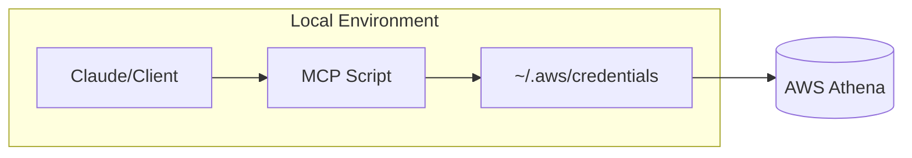
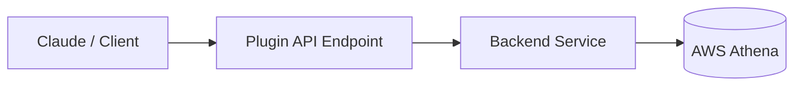
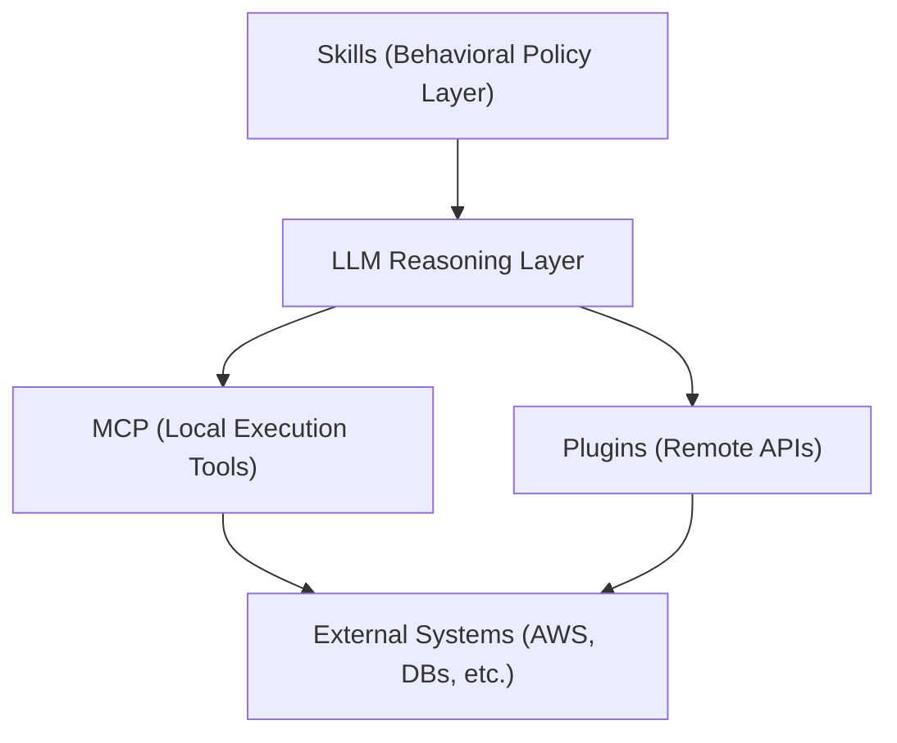

# The Integration Layer: Why MCPs “Blow Up” Context

I wrote this post primarily to dig into why the Model Context Protocol (MCP) is often blamed for consuming massive context windows and driving out-of-control token costs in online discussions.

The main complaint I see of MCP centers on its tendency to create massive context windows, leading to higher costs and increased latency. This isn't necessarily a bug, but a side effect of a fundamental difference in how data moves into the model. Traditional Plugins and Skills treat tools as functions with strict schemas: the model calls a defined tool and receives a targeted, concise response that keeps the context window small.

MCPs, in contrast, treat tools as data providers that stream *any information* (be it files, logs, or database rows) directly into the prompt. In this philosophy, the model acts as the primary interpreter: So it gets a huge blob of raw data and reasons about it in an entirely flexible manner, treating it purely as unstructed text at the onset. This means that even if only 5% of a document is relevant, often 100% of it is loaded into the context, turning the context window itself into the integration layer.

But this is also a product of how MCPs are designed - if you have an MCP that provides large unsorted blobs of data like this, you end up getting that flexibility. If you didn't and you previously had more scoped MCPs, there are other considerations vs. a plugin for example, that need to be considered. Those will be discussed later.

# Local Execution and the Permission Model

The architectural shift in MCP is most apparent when looking at local execution. Thus, one of the most important distinctions in MCP architectures is **where execution happens and under whose identity**.

Consider a scenario where an AI agent needs to perform an AWS Athena query.

## The MCP Model: “Run as You”

In an MCP setup, the "server" is frequently just a local script (Python or Node) running on your machine. When the LLM invokes an MCP tool to run a query, the script executes as a local process.

### Flow Diagram

### What this means

Because this script lives in your environment, it implicitly inherits your identity, utilizing your local credentials and active SSO sessions. This provides immense flexibility but introduces a significant permissions risk. That is, the model effectively gains a "remote control" for your environment. It will execute any query you are personally authorized to run unless your code explicitly blocks it. That is, event if your prompt says not to do something, there is a risk that it may be done regardless - there is no guarantee against those hazards.

### The tradeoff

**Pros**

* Extremely flexible
* Easy to iterate
* Powerful local integrations

**Cons**

* High permission risk
* The model can indirectly trigger any action you are authorized to perform
* Safety depends entirely on your code (not the prompt)

## The Plugin Model: “Call a Service”

Conversely, a plugin calls a remote hosted service via an API. The execution happens on an external server using service-side credentials. This creates a very explicity and hard control boundary; the model is confined to defined endpoints and schemas, and the backend enforces security rules that the model cannot bypass through prompt manipulation alone.

# Memory, the Harness, and Identity

There is additional consideration to be had regarding reliance on memory when evaluating data from an MCP response and holding it in raw, blob text form for evaluation and downstream flow reference. Specifically, you are relying on the behavior of the agent/harness and how it manages memory to ensure the important elements from your MCP response are preserved. This is subject to the agent's interpration during runtime and not explicitly handled like in a plugin.

A helpful insight that further expands on this comes from this blog post ["Your harness, your memory"](https://blog.langchain.com/your-harness-your-memory/) is that memory is not a plugin: it lives in the harness. The "harness" is the system managing the context lifecycle, such as Cursor or a managed chat interface (Opus, Codex, etc.). It is the harness that makes "invisible decisions" about what to summarize, truncate, or delete as the conversation progresses.

While MCP assumes memory is external data we can supply, the reality is that memory is whatever survives the context management of the harness. This creates a form of "state dependency". If the harness owns the memory, you cannot easily move your agent's learned patterns or history between different platforms.

# Skills: The Behavioral Layer

To complete the hierarchy, skills act as a third layer that sits above execution. While MCPs and plugins provide the capabilities (e.g. "What code or services can I run?"), skills provide the policies (e.g. "How should I behave?").

So we can see how the two aforementioned concepts can exist in parallel and interact with the same remote resources, but with plugins and MCPs existing as different intermediaries with different potential permissions scopes and degrees of flexibility. Then, skills provide guidance on how to use either of these (or any other available tooling).

A skill does not directly access AWS or run queries. Instead, it biases the model's decision-making process—for instance, instructing it to always inspect a schema or, for example, apply a `LIMIT 1000` before invoking the Athena DWH query tool. The tool then, can exist in entities such as the more deterministic MCP and plugin layer described prior.

# Conclusion

Ultimately, the choice between these architectures is a trade off. MCPs provide the most flexibility for reasoning by operating directly within your local environment, yet they inherit the risk of lower explicit control, especially as they are running with your full identity rather than as a sandboxed agent. Plugins are on the other end of the spectrum in this sense: they are strictly scoped by design, both in their permission sets and in how the agent harness prioritizes their structured responses within its memory. Above both these execution layers sit skills, acting as the behavioral guide. They don't handle the mechanics of the query, but instead set preferences for agents on when to lean into the flexible stream of an MCP and when to rely on the predictable boundaries of a plugin.